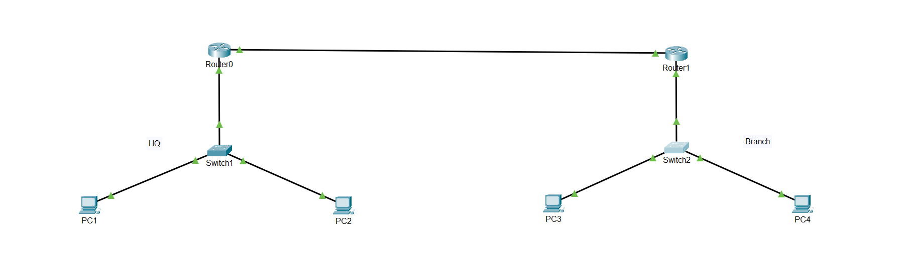

# CCNA Network Design with VLANs and Inter-VLAN Routing (Prepared for Automation)

## Overview
This Packet Tracer project simulates a small business network with two sites (HQ and Branch), featuring VLAN segmentation, inter-VLAN routing, and SSH configuration for potential automation. The project demonstrates CCNA-level skills in network design and configuration.

## Topology
- **Devices**:
  - 2 Routers: Router0 (HQ), Router1 (Branch)
  - 2 Switches: Switch1 (HQ), Switch2 (Branch)
  - 4 PCs: PC1-HQ, PC2-HQ (HQ VLAN 10), PC3-Branch, PC4-Branch (Branch VLAN 20)
- **Connections**:
  - Router0 (Gig0/0) to Switch1 (Fa0/24)
  - Router0 (Gig0/1) to Router1 (Gig0/0) (WAN link)
  - Switch1 (Fa0/1, Fa0/2) to PC1-HQ, PC2-HQ
  - Router1 (Gig0/1) to Switch2 (Fa0/24)
  - Switch2 (Fa0/1, Fa0/2) to PC3-Branch, PC4-Branch
- **IP Addressing**:
  - HQ Network (VLAN 10): 192.168.10.0/24
  - Branch Network (VLAN 20): 192.168.20.0/24
  - WAN Link: 10.0.0.0/30



## Features
- **VLAN Segmentation**: HQ (VLAN 10) and Branch (VLAN 20) are separated for logical network organization.
- **Inter-VLAN Routing**: Configured using subinterfaces on Router0 and Router1 to allow communication between HQ and Branch.
- **SSH Configuration**: All devices (Router0, Router1, Switch1, Switch2) are configured with SSH for secure remote access, prepared for automation.
- **Automation Attempt**: Includes a Python script (`test_paramiko.py`) to automate SSH connections, though connectivity issues prevented full implementation.

## Files
- `network-automation-pt.pkt`: Packet Tracer project file.
- `router0-config.txt`: Router0 configuration.
- `router1-config.txt`: Router1 configuration.
- `switch1-config.txt`: Switch1 configuration.
- `switch2-config.txt`: Switch2 configuration.
- `test_paramiko.py`: Python script for SSH automation (attempted).
- `topology.png`: Screenshot of the network topology.

## How to Use
1. Open `network-automation-pt.pkt` in Cisco Packet Tracer.
2. Verify connectivity:
   - From PC1-HQ, ping PC2-HQ (`192.168.10.11`) to test within HQ.
   - From PC3-Branch, ping PC4-Branch (`192.168.20.11`) to test within Branch.
   - From PC1-HQ, ping PC3-Branch (`192.168.20.10`) to test inter-VLAN routing.

## Automation Script (`test_paramiko.py`)

```python
import paramiko
import time

# Device details for Router0
ip = "192.168.10.1"
username = "admin"
password = "admin123"

try:
    print(f"Connecting to Router0 ({ip})...")
    # Create SSH client
    ssh = paramiko.SSHClient()
    ssh.set_missing_host_key_policy(paramiko.AutoAddPolicy())
    # Connect to Router0
    ssh.connect(ip, username=username, password=password, timeout=10)

    # Start an interactive shell
    shell = ssh.invoke_shell()
    time.sleep(1)

    # Send command
    shell.send("show version\n")
    time.sleep(2)

    # Read output
    output = shell.recv(65535).decode('utf-8')
    print(f"Output from Router0:\n{output}")

    # Close connection
    ssh.close()
    print("Disconnected from Router0.")

except Exception as e:
    print(f"Failed to connect to Router0: {str(e)}")
